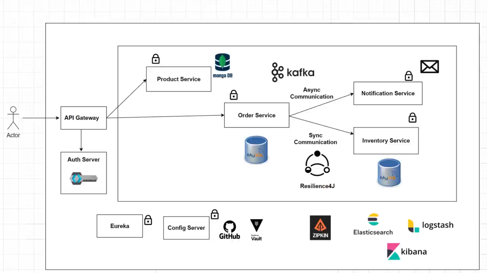

<br/>
<br/>   
     
# Keycloak congif :
 > docker run -p 8181:8080 -e KEYCLOAK_ADMIN=admin -e KEYCLOAK_ADMIN_PASSWORD=admin quay.io/keycloak/keycloak:24.0.2 start-dev  

 >  login ``` http://localhost:8181/admin/master/console/ ``` 

. Make new Realm ``` spring-boot-microservices-realm ```  
. Make a new client ``` spring.cloud.client ```


* Capability config :   
    * Authentication flow
        * Turn on client Auth
        * Turn off Standard flow & Direct access grants
        * Turn On Service accounts roles


<br/>

# Zipkin config : 
> docker run -d -p 9411:9411 openzipkin/zipkin

<br/>

# Kafka config : 
> refer to  : https://docs.confluent.io/platform/current/platform-quickstart.html

> Navigate to Control Center at http://localhost:9021